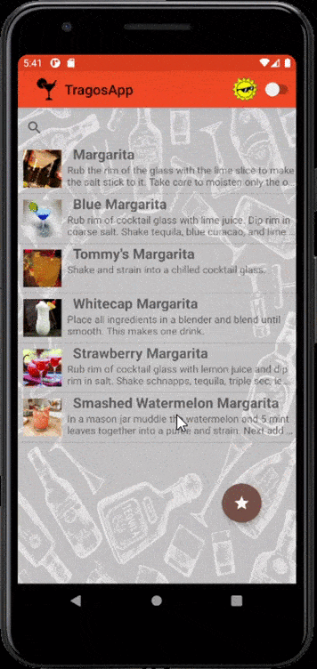

# TragosApp
🍹 TheCockTailDB Api: https://www.thecocktaildb.com/api.php

## Construido con 🛠️ (Build in)
* [AndroidStudio](https://developer.android.com/studio) - v4.0.1
* [Kotlin](https://kotlinlang.org) - Lenguaje

## Librerias Utilizadas 📚 (Libraries used)
* [RetroFit](https://square.github.io/retrofit/) - v2.7.1
* [Picasso](https://square.github.io/picasso/) - v2.71828
* [PhotoView](https://github.com/chrisbanes/PhotoView) - v2.0.0
* [Room](https://developer.android.com/jetpack/androidx/releases/room) - v2.2.5
* [Dagger Hilt](https://developer.android.com/training/dependency-injection/hilt-android?hl=es-419) - v1.0.0-alpha02
* [Navigation component](https://developer.android.com/guide/navigation/navigation-getting-started) - v2.3.1

## App Corriendo 	🏃 (Running app)

